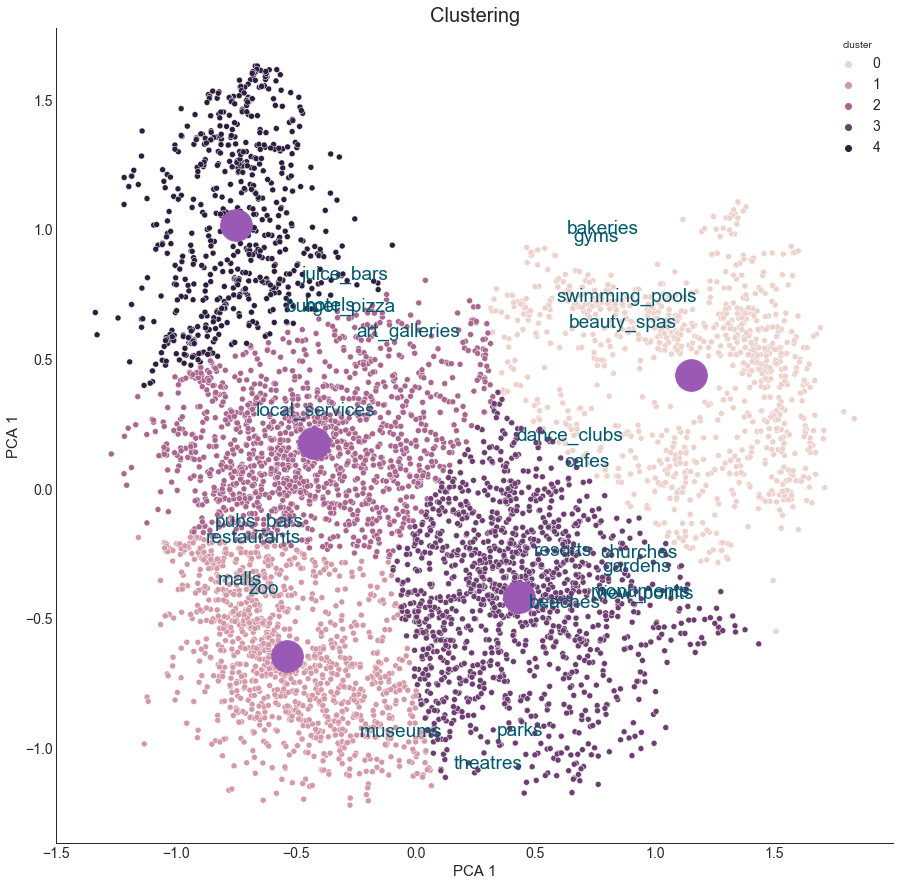

# Travel Rating Clustering

This dataset describes how users rate their estimates. And if you look at some of them, we can see that they’re quite clearly divided into groups. Our job is to learn how to separate them. This is important because it will allow us to work more efficiently with our users. For example, based on clusters, we can offer people services more specifically and personalized.

## Code and Resources Used
Python Version: 3.7

Packages: pandas, numpy, sklearn, matplotlib, seaborn

This data set has been sourced from the Machine Learning Repository of University of California, Irvine (UC Irvine) : Travel Review Ratings Data Set

The UCI page mentions the following publication as the original source of the data set: Renjith, Shini, A. Sreekumar, and M. Jathavedan. 2018. Evaluation of Partitioning Clustering Algorithms for Processing Social Media Data in Tourism Domain. In 2018 IEEE Recent Advances in Intelligent Computational Systems (RAICS), 12731. IEEE

## Goals and objectives
My goal to divide users in different clusters, which would help us to recommend them different types of advertisment
To do this I should do next things:

  - To make exploratory data analysis

  - To prepare our data for clustering

  - To build and upgrade our Machine Learning Clustering Model

## Exploratory Data Analysis

As a result of this phase, we have prepared almost everything for data preprocessing, including we have already removed the missing values, renamed the columns, led to the same view. In addition, we looked at how the values of our features are distributed, the estimated number of clusters, the relationships, and so on, what’s important in the next phase. Let us examine in detail the three most important graphs that we have received from this phase.

One of the most important graphics we needed to build was a cluster map, because it allows us to understand how and to which clusters our data are divided. On it we can see that we have some brightly selected groups. This will be useful at the stage of model construction.

Boxplots were the next important graphics for us. On them we can see how our features are distributed. It was this chart that gave me an idea of exactly how we would transform our data in the next phase.

## Data Preprocessing

In this part I only scale our data, because we rename our data for model building. All of this code you can find in separate file, which we can use for embeding into the work process.

At this stage I prepared data for model construction. To do this, I did the following things:
  - Compile a list of features to be normalized
  - Normalize our data.
  - Upload it.
  
I didn't rename it, delete NaN values or change string to float64, because it was all this in the past. The key here was to get the data back to one form.

## Model Building

Here I built a model for clustering. In this case I lowered the dimension with principal component analysis. And then, with the help of k-means clustering, I clustered data, which had already been reduced in size.

## Conclusion

Here I will summarize the results of our clustering.

Based on the visualization presented below, we can say that we have five groups of people who give estimates:

  1. People who visit spas, swimming pools, gyms and bakeries. And what’s very interesting is maybe we should go into that and explore that relationship.
  2. People who have visited shopping malls, zoos, restaurants, etc.
  3. People who visit local services, bars, art galleries, etc.
  4. People who visit parks, beaches, theatres, gardens, etc.
  5. People who have visited burgers and pizzerias, hotels and bars.

These are important results, as we are able to process new user queries on the basis of these data and give them certain recommendations of various kinds. The model is stored in a separate file.

 
